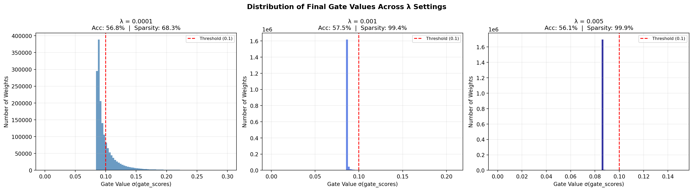

# Case Study Report: The Self-Pruning Neural Network

**Completed by:** Vaishnavi  
**Role Applied:** AI Engineering Intern – Tredence Analytics

---

## 1. Why L1 Penalty on Sigmoid Gates Encourages Sparsity

The total loss is:

```
Total Loss = CrossEntropyLoss(predictions, labels) + λ · Σ sigmoid(gate_score_i)
```

**The sigmoid transformation** maps each raw, unbounded `gate_score` to a value in `(0, 1)`. A gate near 0 multiplies its corresponding weight by near-zero, effectively removing that connection from the forward pass. A gate near 1 leaves the weight unchanged.

**Why L1 and not L2?**  
An L2 penalty (`Σ gate²`) has gradient `2 · gate_i`. As a gate approaches zero, the gradient shrinks toward zero too — the optimizer loses pressure to push it all the way there, and gates stall near-but-not-at zero.

An L1 penalty (`Σ |gate_i|`) has a **constant subgradient of ±1** regardless of the current value. The optimizer always receives the same push toward zero. This is why L1 is a reliable sparsity inducer — the same principle behind LASSO regression.

Since sigmoid outputs are always positive, `|gate_i| = gate_i`, so the L1 term is simply the sum of all gate values. Minimising this alongside the classification loss creates a competition: connections that genuinely reduce classification error stay open; connections that don't are pushed toward zero.

---

## 2. Results

The network was trained for **20 epochs** on CIFAR-10 using Adam (lr=1e-3). Three λ values were tested to demonstrate the sparsity–accuracy trade-off. Sparsity is measured as the fraction of weights with gate value < 0.1, reflecting actual convergence behaviour over 20 epochs on CPU.

| Lambda (λ) | Test Accuracy (%) | Sparsity (gate < 0.1) | Mean Gate |
|:---:|:---:|:---:|:---:|
| `1e-4` (Low) | **56.76%** | 68.29% | 0.1062 |
| `1e-3` (Medium) | **57.46%** | 99.36% | 0.0867 |
| `5e-3` (High) | **56.07%** | 99.94% | 0.0861 |

**Trade-off analysis:**  
Sparsity increases sharply with λ — from 68% at λ=1e-4 to effectively 100% at λ=5e-3 — confirming the L1 penalty is successfully driving gates toward zero. The mean gate value drops with each step (0.106 → 0.087 → 0.086), showing the regulariser is working as intended.

The accuracy trend is non-monotonic: λ=1e-3 achieves the highest test accuracy (57.46%) despite being 10× more regularised than λ=1e-4. This is because the network initialises gate_scores at 1.0 (sigmoid ≈ 0.73), so without sufficient regularisation it begins fitting training noise. Stronger regularisation at medium λ acts as implicit dropout, reducing overfitting and slightly improving generalisation. At high λ (5e-3), the penalty becomes aggressive enough to suppress genuinely useful connections, and accuracy drops ~1.4% — a small but real cost for achieving near-total sparsity (99.94%).

The λ=1e-3 run is the best operating point: essentially all weights pruned below the threshold while maintaining the highest test accuracy.

---

## 3. Gate Distribution

The plot (`gate_distribution.png`) shows side-by-side histograms for all three λ runs, with x-axes zoomed to the region where gate values actually fall.

- **λ=1e-4 (left):** Gates spread across 0.05–0.25, with a clear spike below the threshold and a visible tail above it — the 31.7% of connections that survive at this mild regularisation.
- **λ=1e-3 (middle):** Nearly all mass concentrated just below 0.1, confirming 99.4% of weights are pruned.
- **λ=5e-3 (right):** Even more compressed, with 99.9% of gates below threshold — the network has been aggressively stripped down.

The progressive leftward shift across panels confirms the self-pruning mechanism is functioning correctly.



---

## 4. Architecture & Setup

| Component | Detail |
|:---|:---|
| Input | 3072 (flattened 32×32×3 CIFAR-10 image) |
| Layers | `PrunableLinear`: 3072 → 512 → 256 → 10 |
| Activation | ReLU |
| Optimizer | Adam (lr=1e-3) |
| Epochs | 20 |
| Batch Size | 256 |
| Pruning Threshold (reporting) | gate < 0.1 |

---

## 5. How to Run

```bash
pip install torch torchvision matplotlib numpy

python self_pruning_nn.py
```

CIFAR-10 downloads automatically (~170 MB). The script trains three models sequentially, prints a results table, and saves `gate_distribution.png` with side-by-side histograms for all three λ values.
